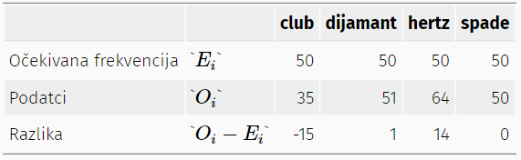

## Kategorijalna analiza 

Kategorijalna analiza se odnosi na skupinu alata koji se koriste kada su podaci nominalne skale

### Goodnes-of-fit test 

Jedan od najstarijih statističkih testova. Osmislio ga je Person (1900.), a doradio Fisher (1922.). Razmatranje pitanja poteškoća pri izvođenju slučajnosti (nasumičnosti).

**Interpretacija rezultata testa:**

1.	Opis podataka i nulte hipoteze

2.	Statistički blok

3.	Interpretacija rezultata


**1.	Opis podataka i nulte hipoteze**
```{r}
#> 'data.frame':    200 obs. of  3 variables:
#>  $ id      : Factor w/ 200 levels "subj1","subj10",..: 1 112 124 135 146 157 168 179 190 2 ...
#>  $ choice_1: Factor w/ 4 levels "clubs","diamonds",..: 4 2 3 4 3 1 3 2 4 2 ...
#>  $ choice_2: Factor w/ 4 levels "clubs","diamonds",..: 1 1 1 1 4 3 2 1 1 4 ...

```

DATA FRAME: 3 faktorske varijable, 200 opservacija, 4 razine: clubs, diamonds, hearts, spades (200x se pojavljuju te 4 kombinacije).
Pitalo se 200 osoba da odaberu svaki po jednu kartu i onda po još jednu.
Očekuje se da će svaki izbor biti odabran 50 puta (200/4).

Tabulirani pregled podataka:

```{r}
#> 
#>    clubs diamonds   hearts   spades 
#>       35       51       64       50
```

O=(O1,O2,O3,O4) → matematičko navođenje opažanih (observed) frekvencija 

_Nulta hipoteza:_

H_0 : _Sve četiri karte su izabrane sa jednakom vjerojatnošću._ (Što bi značilo dasvaka od 4 vrste karata ima 25% 
šanse da bude izabrana)

Formalni zapis H_0		P = (.25, .25, .25, .25)	


**2.	Statistički blok**

Izrada testne statistike koja mjeri koliko su podaci bliski nultoj hipotezi.

_Formiranje vjerojatnosti:_

Ei=N×Pi

Ei – očekivana vrijednost

N – broj ljudi

Pi – vjerojatnost svakog od izbora




Usporedimo očekivanu frekvenciju s podacima i napravimo razliku.

Izračun:
 
- Oduzimanje očekivanih frekvencija od podataka

-	Kvadriranje razlike

-	Skaliranje

-	Svaka varijabla je binomno distribuirana – dobiti standardnu distribuciju varijable i hi kvadrat distribuciju

_Stupnjevi slobode_ – odnose se na ograničenja koja uvjetuju izgled distribucije

Računamo ih brojenjem brojeva različite kvantitete koji se koriste za opis naših podataka; a zatim oduzimanjem svih ograničenja koja ti podaci moraju zadovoljiti


**3.	Interpretacija rezultata**

Prikaz kritičke regije za odbacivanje nulte hipoteze
```{r}
#slika
```

Možemo odbaciti Nul hipotezu koja glasi „Sve četiri karte su izabrane sa jednakom vjerojatnošću.“ jer vrijednost od 8,44 prelazi kritičku vrijednost od 7,81 (podaci su dovoljno nevjerojatni za odbacivanje). 

PROVOĐENJE TESTA U R-u:

```{r}
#lsr::goodnessOfFitTest( cards$choice_1 )
#> 
#>      Chi-square test against specified probabilities
#> 
#> Data variable:   cards$choice_1 
#> 
#> Hypotheses: 
#>    null:        true probabilities are as specified
#>    alternative: true probabilities differ from those specified
#> 
#> Descriptives: 
#>          observed freq. expected freq. specified prob.
#> clubs                35             50            0.25
#> diamonds             51             50            0.25
#> hearts               64             50            0.25
#> spades               50             50            0.25
#> 
#> Test results: 
#>    X-squared statistic:  8.44 
#>    degrees of freedom:  3 
#>    p-value:  0.038			→	P vrijednost iznosi 0.038 = 3,8%
```


### Test nezavisnosti kategorija

Testiranje povezanost kategoričkih varijabli.


**1.	Opis podataka i nulte hipoteze**
```{r}
#> 'data.frame':    180 obs. of  2 variables:
#>  $ species: Factor w/ 2 levels "robot","human": 1 2 2 2 1 2 2 1 2 1 ...
#>  $ choice : Factor w/ 3 levels "puppy","flower",..: 2 3 3 3 3 2 3 3 1 2 ...
```

_Data frame_ - 3 izbora – puppy, flower, data; 2 varijable (vrste) – robot, human; 180 opervacija

Tabulirani pregled podataka:

```{r}
#>         species
#> choice   robot human
#>   puppy     13    15
#>   flower    30    13
#>   data      44    65
```

_Nulta hipoteza:_

H_0:	Sve od sljedećeg je točno:

P_11 = P_12 (jednaka vjerojatnost izbora puppy)

P_21 = P_22 (jednaka vjerojatnost izbora flower)

P_31 = P_32 (jednaka vjerojatnost izbora data)


**2.	Statistički blok**

Formuliranje testne statistike (složeniji postupak)

```{r}
#Slika
```

_Stupnjevi slobode_

df=(r−1)(c−1)

(r−1) - broj opservacija 

(c−1) - broj ograničenja

Provođenje testa u Ru:

```{r}
# Izvedi test u R
#associationTest( formula = ~ choice + species, data = chapek9 )
#> 
#>      Chi-square test of categorical association
#> 
#> Variables:   choice, species 
#> 
#> Hypotheses: 
#>    null:        variables are independent of one another
#>    alternative: some contingency exists between variables
#> 
#> Observed contingency table:
#>         species
#> choice   robot human
#>   puppy     13    15
#>   flower    30    13
#>   data      44    65
#> 
#> Expected contingency table under the null hypothesis:
#>         species
#> choice   robot human
#>   puppy   13.5  14.5
#>   flower  20.8  22.2
#>   data    52.7  56.3
#> 
#> Test results: 
#>    X-squared statistic:  10.722 
#>    degrees of freedom:  2 
#>    p-value:  0.005 
#> 
#> Other information: 
#>    estimated effect size (Cramer's v):  0.244
```


**3.	Interpretacija rezultata**

P vrijednost iznosi 0.005 = 0,5%

Odbacujemo Nul hipotezu i zaključujemo da su varijable zavisne, odnosno da je izbor zavisan o vrsti.


### Pretpostavke (uvjerljivost) GOF i testa nezavisnosti

1.	_Očekivane frekvencije su dovoljno velike_ – izbori se dovoljno često pojavljuju (>5, za veće tablice vjerojatno bi bio u redu da je barem 80% očekivanih frekvencija iznad 5 i nijedan od njih nije ispod 1)

2.	_Podatci su međusobno neovisni_ – nezavisne opservacije i odgovori (moguće je koristiti McNemarov test ili Cochranov test)


### Izvođenje chi-sq testova u R

**(Uvjerljivost testa)**

```{r}
# Pregledaj podatke
# podatci
#> 
#>    clubs diamonds   hearts   spades 
#>       35          51             64          50

# Izvedi chi-sq test na standardni način
# chisq.test(x = podatci)
#> 
#>     Chi-squared test for given probabilities
#> 
#> data:  podatci
#> X-squared = 8.44, df = 3, p-value = 0.03774	→ P vrijednost iznosi 0.03774 = 3,8%
```

Odbacujemo Nul hipotezu, što znači da su statističke kategorije različite (nisu 4x50, nego 35, 51, 64 i 50)


### Fisherov test za male uzorke

Kada je broj frekvencija mali, odnosno kada imamo premalo podataka, ne možemo napraviti hi-kvadrat test i potrebne su određene prilagodbe. Korištenje krivog testa može dovesti do (ne)odbacivanja hipoteze.

Rezultat hi-kvadrat testa a tabuliranim objektom: P vrijednost iznosi 0.06888 = 6,9%

Provođenjem Fisherovog test: P vrijednost iznosi 0.03571 = 3,6%	→   Možemo odbaciti Nul hipotezu!


### McNemarov test zavisnih uzoraka

Kada su podaci međusobno zavisni (npr. ispitivanje odluke 100 ljudi prije i nakon gledanja reklame u konačnici iznosi 200 opservacija). Marginalna  homogenost - ukupni redovi i stupci imaju jednaku raspodjelu.

Razlika između testova:

- test nezavisnosti koristimo kada želimo saznati je li odluka koju smo donijeli drugi puta povezana sa odlukom koju smo donijeli prvi puta - razmatramo povezanost redaka i kolona

- jesu li se razlikovale učestalosti prve i druge odluke, to jest želimo istražiti je li zbroj redaka različit od zbroja stupaca - tada upotrebljavamo McNemarov test

Rezultat hi-kvadrat testa: P vrijednost iznosi 0.0005909 = 0,05%

Rezultat McNemarovog testa: P vrijednost iznosi 0.01358 = 1,36%

→ u oba slučaja odbacujemo Nul hipotezu!


## Usporedba prosjeka

Usporedbom dvaju prosjeka želimo usporediti sredstva dviju skupina. U svim situacijama, varijabla ishoda je poprilično kontinuirana, intervalna ili omjerna, a prediktor je binarna varijabla grupiranja.


### z-test

Više se nigdje ne koristi. Moguća dvostrana i jednostrana hipoteza.

**Pretpostavke testa:**

1.	Normalnost distribucije

2.	Nezavisnost podataka u uzorku

3.	Poznata standardna devijacija (z test pretpostavlja da je standardna devijacija poznata)

_Postavljanje hipoteze:_

Jesu li ocjene studenata sociologije više od prosjeka na fakultetu?

H0:μ=67.5

H1:μ≠67.5

Grafički prikaz hipoteze:

```{r}
#slika
```

_Grafički prikaz podataka:_

```{r}
#snipp
```

P vrijednost iznosi 0.02384574 = 2,4% → Odbacujemo Nul hipotezu: prosjek studenata na sociologiji nije viši od prosjeka sudenata na fakuletu.


### t-test

Koristi se kada nam je nepoznata standardna devijacija

**Pretpostavke t testa:**

1.	Normalnost distribucije

2.	Nezavisnost

Grafički prikaz hipoteze:

```{r}
#snipp
```

Grafički prikaz distribucije:

```{r}
#snipp
```

U t distribuciji repovi su deblji jer se SD pretpostavlja. Što je veći broj stupnjeva slobode, to je t distribucija sličnija normalnoj.

P vrijednost iznosi 0.036 = 3,6% → Odbacujemo Nul hipotezu: prosjek ocjena studenata na sociologiji nije isti kao prosjek sudenata na fakuletu.


### t-test u nezavisnim uzorcima (Student)

_Pretpostavke testa:_

1.	Normalnost distribucije

2.	Nezavisnost

3.	Homogenost varijance (jednake su)

```{r}
#> 'data.frame':    33 obs. of  2 variables:
#>  $ grade: num  65 72 66 74 73 71 66 76 69 79 ...
#>  $ tutor: Factor w/ 2 levels "Anastasia","Bernadette": 1 2 2 1 1 2 2 2 2 2 ...
```

_Data frame:_ podatkovni skup od 2 varijable, 33 opservacije

Statistički testiramo jesu li ocjene iste kod svakog mentora

Nezavisni uzorak – ne vjerujemo da su ocjene između 2 mentora povezane i zato ih gledamo kao međusobno nezavisne opservacije

Zanima nas prosjek i SD za svakog mentora


_Postavljanje hipoteze:_

H0:μ1=μ2

H1:μ1≠μ2

PROVOĐENJE TESTA U R-u:

```{r}
# Izvedi test
#independentSamplesTTest( 
#      formula = grade ~ tutor,  # Formula za zavisnu i nezavisnu varijablu
#     data = harpo,             # Podatci
#      var.equal = TRUE          # Pretpostavka jednakih varijanci	   varijance (SD) jednake – 
#  								    (karakteristika Studentovog testa)
#> 
#>    Student's independent samples t-test 
#> 
#> Outcome variable:   grade 
#> Grouping variable:  tutor 
#> 
#> Descriptive statistics: 
#>             Anastasia Bernadette
#>    mean        74.533     69.056
#>    std dev.     8.999      5.775
#> 
#> Hypotheses: 
#>    null:        population means equal for both groups	->	Nul hipoteza
#>    alternative: different population means in each group
#> 
#> Test results: 
#>    t-statistic:  2.115 
#>    degrees of freedom:  31 
#>    p-value:  0.043 	->			P vrijednost iznosi 0.043 = 4,3%
#> 
#> Other information: 
#>    two-sided 95% confidence interval:  [0.197, 10.759] 
#>    estimated effect size (Cohen's d):  0.74

```

Odbacujemo Nul hipotezu: prosjek ocjena nije jednak kod oba mentora.


### t-test u nezavisnim uzorcima (Welch)

Realnija verzija usporedbe 2 prosjeka. Ne pretpostavlja homogenost varijance (različite SD).

**Pretpostavke testa:**

1.	Normalnost distribucije

2.	Nezavisnost

```{r}
#slika
```

Pretpostavljena je normalna distribucija kao i kod Studentovog testa, ali razlika je u tome što se kod alternativne hipoteze ne zahtjevaju jednake varijance (različite SD).

P vrijednost iznosi 0.054 = 5,4% - različite p vrijednosti zbog nerealne pretpostavke kod Studentovog testa!


### t-test u zavisnim uzorcima

Npr. prosjek ocjena za iste studente na 2 kolokvija, odluka istih glasača prije i nakon odgledane reklame, itd.

P vrijednost iznosi <001 pa toga odbacujemo Nul hipotezu: razlika u prosjecima populacija nije 0. Zaključujmo da postoji razlika među njima.


### Jednostrani testovi 

Provodi se u slučaju kada znamo smjer odnosa. Pretpostavlja se da je prosjek uzorka veći od pretpostavljenog prosjeka populacije.


### Efekt veličine

Predstavlja snagu procijenjenog odnosa. Mjera veličine razlike između dviju populacija ili veličine povezanosti među varijablama, a što je preklapanje veće, to je veličina uzorka manja. Ispituje koliko je fenomen rasprostranjen u N ili stupnju u kojem je Nul hipoteza netočna. Računa se pomoću Choenove d statistike.

```{r}
# 2 slike
```

d statistika pokazuje kolika je razlika između dva prosjeka izraženo u standardnim devijacijama


### Provjera normalnosti distribucije

Je li uzorak normalno distribuiran možemo provjeriti

-	Vizualno (QQ plot)

-	Formalno – statističkim testom (Shapiro-Wilk test)


### Ne-standardna distribucija

Kod nestandardno distribuiranih varijabli koristimo druge testove (ne pretopstavljaju normalnost distribucije – neparametrijski testovi):

-	Wilcoxson test za dva uzorka (poznat i kao Mann-Whitney test)

-	Wilcoxson test za jedan uzorak


## Anova

Jedan od najčešće korištenih alata u statistici. Poznat je kao analiza varijance. Razvio Sir Ronald Fisher.

Usporedba više prosjeka.

```{r}
#> 'data.frame':    18 obs. of  3 variables:
#>  $ drug     : Factor w/ 3 levels "placebo","anxifree",..: 1 1 1 2 2 2 3 3 3 1 ...
#>  $ therapy  : Factor w/ 2 levels "no.therapy","CBT": 1 1 1 1 1 1 1 1 1 2 ...
#>  $ mood.gain: num  0.5 0.3 0.1 0.6 0.4 0.2 1.4 1.7 1.3 0.6 ...
# -	DATA FRAME: 18 opservacija, 3 varijable (drug, therapy - faktorske)
#>        drug         therapy             mood.gain     
#>  placebo :6   no.therapy:9   Min.   :0.1000  
#>  anxifree:6   CBT:9 		  1st Qu.:0.4250  
#>  joyzepam:6           	      	 Median :0.8500  
#>                            		  Mean   :0.8833  
#>                            		  3rd Qu.:1.3000  
#>                           		   Max.   :1.8000

# Agregiraj podatke po primjenjenom ljeku
# aggregate( mood.gain ~ drug, clin.trial, mean ) # Prosjek
#>       drug mood.gain
#> 1  placebo 0.4500000
#> 2 anxifree 0.7166667
#> 3 joyzepam 1.4833333
# aggregate( mood.gain ~ drug, clin.trial, sd )   # Standardna devijacija
#>       drug mood.gain
#> 1  placebo 0.2810694
#> 2 anxifree 0.3920034
#> 3 joyzepam 0.2136976

```

_Deskriptivna statistika:_  po 6 opsevacija, 9 iz terapija, porast raspoloženja
-	Joyzepam djeluje najbolje, placebo najmanje ali svjedeno dosta visoko djeluje – oboje imaju istu SD

_Postavljanje hipoteze:_ prosjek je isti za sva 3 lijeka.

H0:točno je μP=μA=μJ

H1:nije točno μP=μA=μJ

Izračun varijance kod ANOVA-e

```{r}
#slike
```

Izračun ANOVA-e:

-	Pregled podataka u tablici

-	Dodaj grupni prosjek

-	Odstupanja od grupnog prosjeka i kvadrati odstupanja 

-	Izračunaj sumu kvadrata odstupanja unutar grupa (suma kvadrata daje varijancu unutar grupa)

SSW – kvadrati odstupanja unutar grupa

SSb – kvadrati odstupanja između grupa

Izračun F-statistike – zbog skaliranja sa stupnjevima slobode 

P vrijednost iznosi 8,6% i stoga prihvaćamo Nul hipotezu.


### Efekt veličina u ANOVA

Za mjerenje efekta veličine najčešće se koristi η 2 (eta kvadrat).

Formula:
```{r}
"slika"
```
 
SSb – kvadrati odstupanja između grupa

SStot – ukupno odstupanje


### Post hoc testovi

Pokrećemo post hot test kako bi se utvrdilo koje se skupine značajno razlikuju jedne od drugih.


### Pretpostavke jednostrane ANOVA-e

1.	Normalnost distribucije

2.	Homogenost varijance

3.	Nezavisnost


### Homogenost varijance

2 testa provjere:

1. 	Leven-ovim testom

2. Brown-Forsythe testom

Jedina razlika između od Levenovog testa je da Brown-Forsythe test je u tome što transformiranu varijablu Z gradi na malo drugačiji način,  koristeći odstupanja od medijana skupine, a ne odstupanja od sredstava skupine.


### Normalnost distribucije

Vizualno

Formalno:
  
  o	Shapiro-Wilkov test
  
  o	Kruskal-Wallis test (neparametrijska statistika na osnovi ranga, alternativna opcija)
